1. Configure the Database Connection String  
Update the connection string in the appsettings.json file to match your SQL Server instance: 

json :  
"ConnectionStrings": {  
  "StringChainCnx": "Server=tcp:{your server database},1433;Initial Catalog={your database};Persist Security Info=False;User ID={Your User Id};Password={your password};MultipleActiveResultSets=False;Encrypt=True;TrustServerCertificate=False;Connection Timeout=30;"
} 

-------"Note: Make sure you have all necessary NuGet packages installed and the correct SDK version. You can verify this in the Technexa.csproj file." -----  

2. Apply Database Migrations : 
  => Open a terminal in your project folder and run the following command to apply migrations and create the database schema:  
    dotnet ef database update 

3. Add Initial Admin Information 
  => Log in to your Microsoft SQL Server and manually add an initial admin record to the database. Use a strong username and password for security. 

4. Build and Run the Project 
  => Run the following commands in your terminal to build and launch the project:  
    dotnet build 
    dotnet run 
  => Access the application in your browser at your http://localhost:5000 or https://localhost:5001 or other  

5. Admin Login 
  => Go to the admin login page at: 
    http://localhost/admin/login 
    Log in using the initial admin credentials you added in step 3. 

6. Create Categories 
  => Navigate to the category creation page:  
    http://localhost/categorie/create 
  => Add categories as needed. Make sure not to use duplicate IDs, as the database does not have auto-increment set for this table. 
  --"Note: Ensure each category has a unique ID." -- 

7. Create Posts 
    => Navigate to the post creation page:  
    http://localhost/post/create 
    => Fill in the required fields. For videos, ensure you have a YouTube channel. Provide the following: 
    * SrcYoutubeVideo: The embedded URL of your YouTube video. 
    Example: https://www.youtube.com/embed/x-e6G-c6xzI?si=w1ft9Moet3IDF6ly 

    * SrcImage: The thumbnail URL for your video. 
    Example: x-e6G-c6xzI/mq2.jpg?sqp=CICi3bIG-oaymwEmCMACELQB8quKqQMa8AEB-AGMAoAC4AOKAgwIABABGHIgUyhAMA8=&rs=AOn4CLDvL0EPQjV6SuwlcVC5ZTYhOtkdmg 

---"Notes:
Ensure your YouTube video URL and thumbnail URL are valid. 
Test the application thoroughly to confirm all functionalities are working as expected. 
If you encounter issues, feel free to ask for assistance! "---

#############################################################

Admin views :

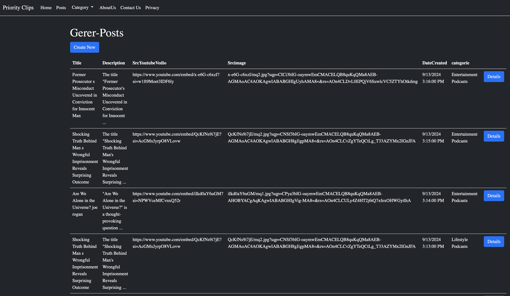

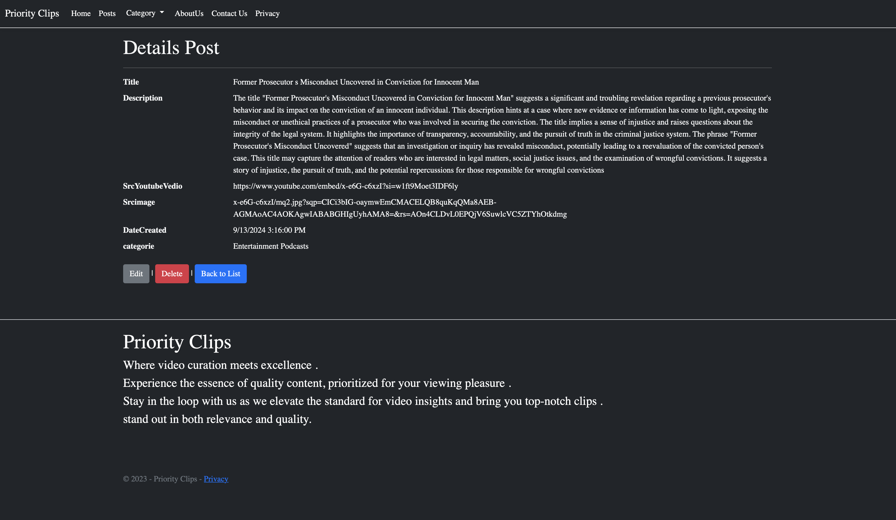

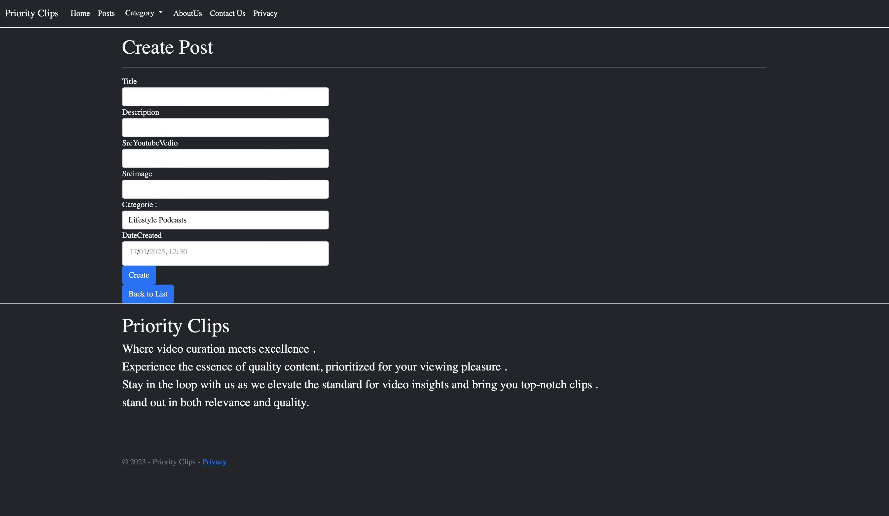

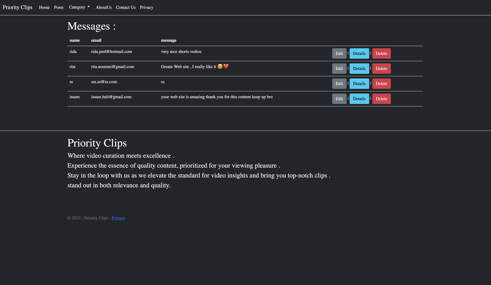

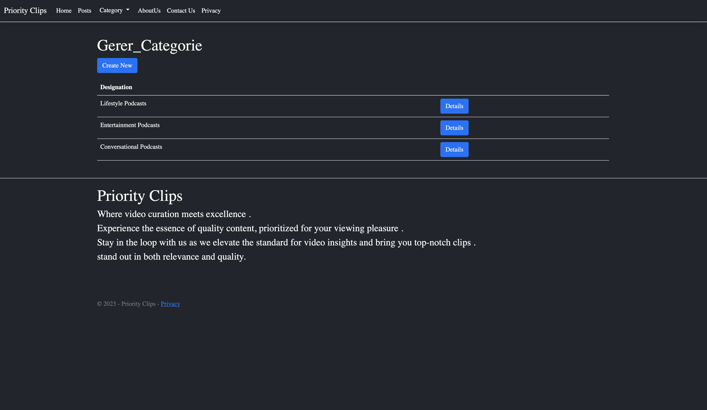

Public  views : 

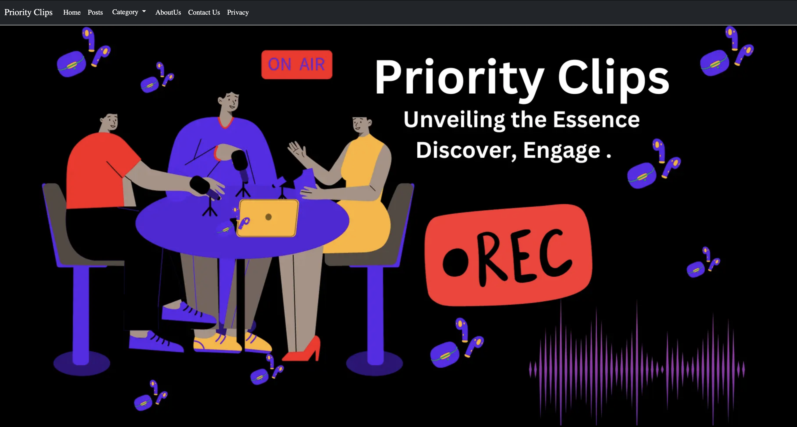

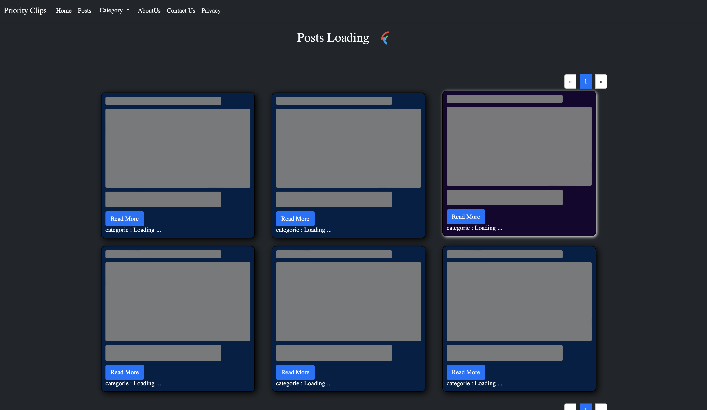

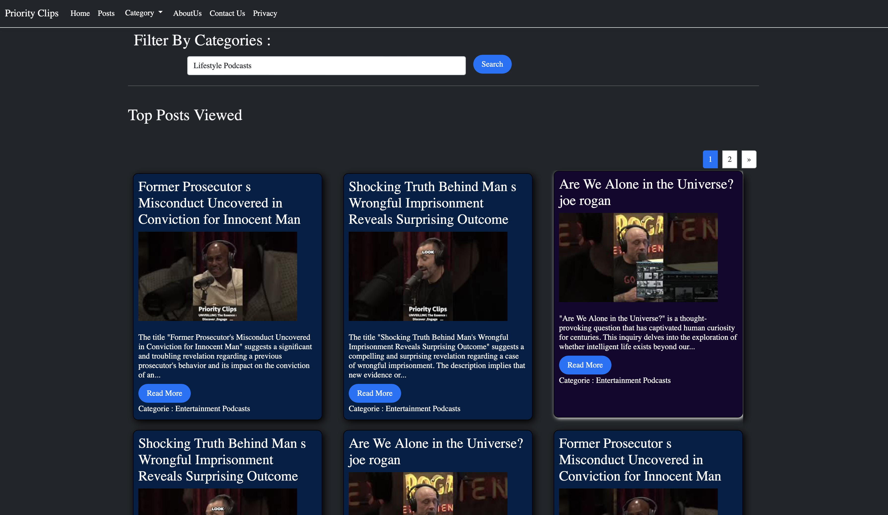

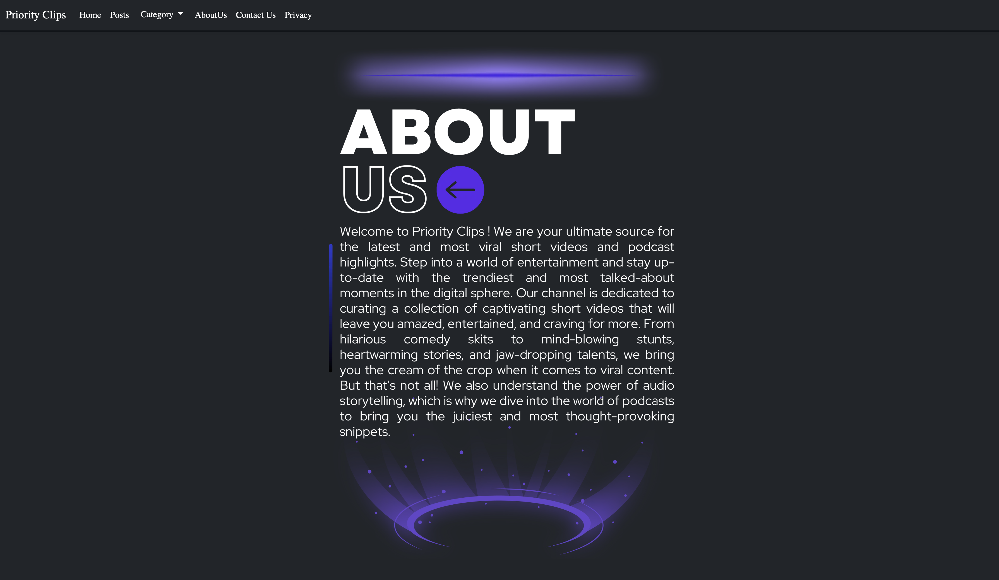

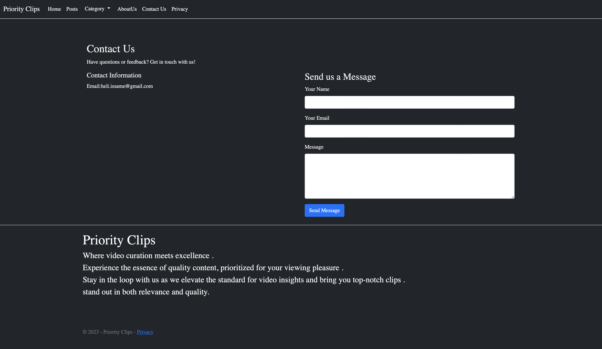

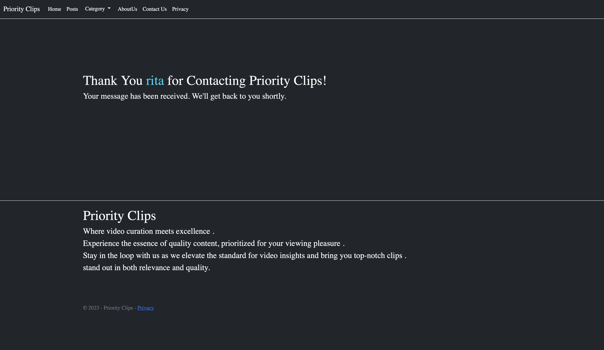

