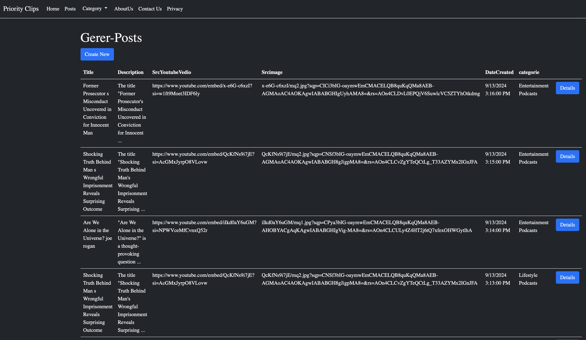
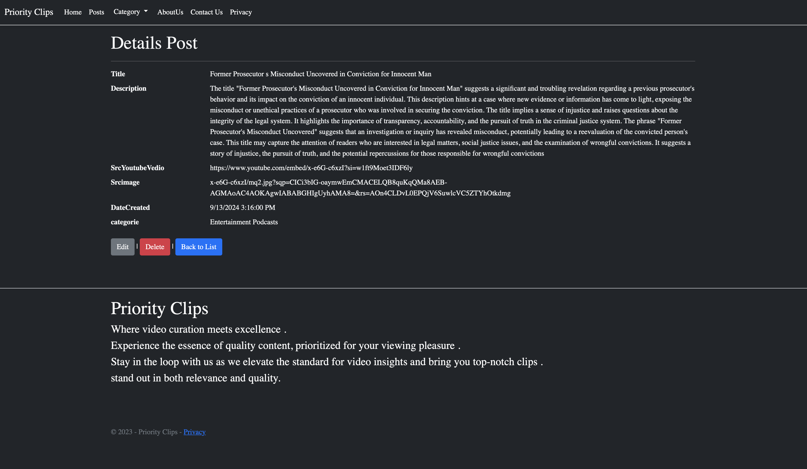
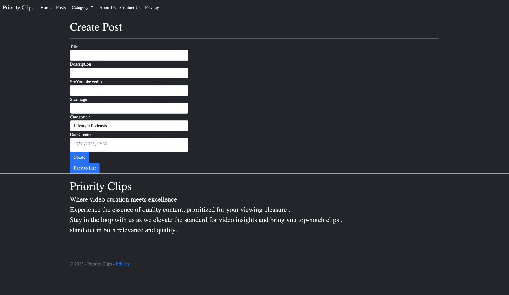
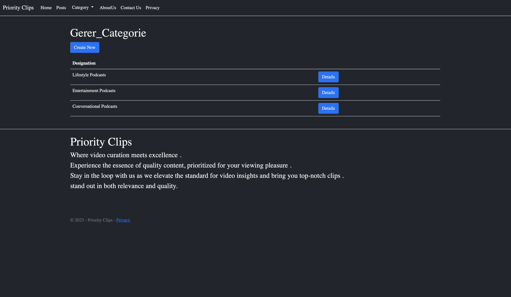
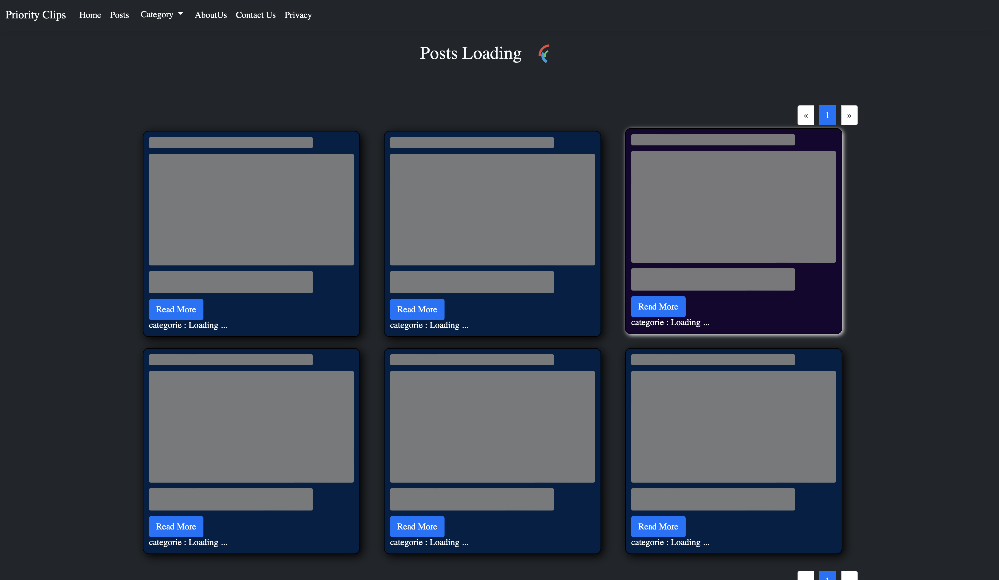
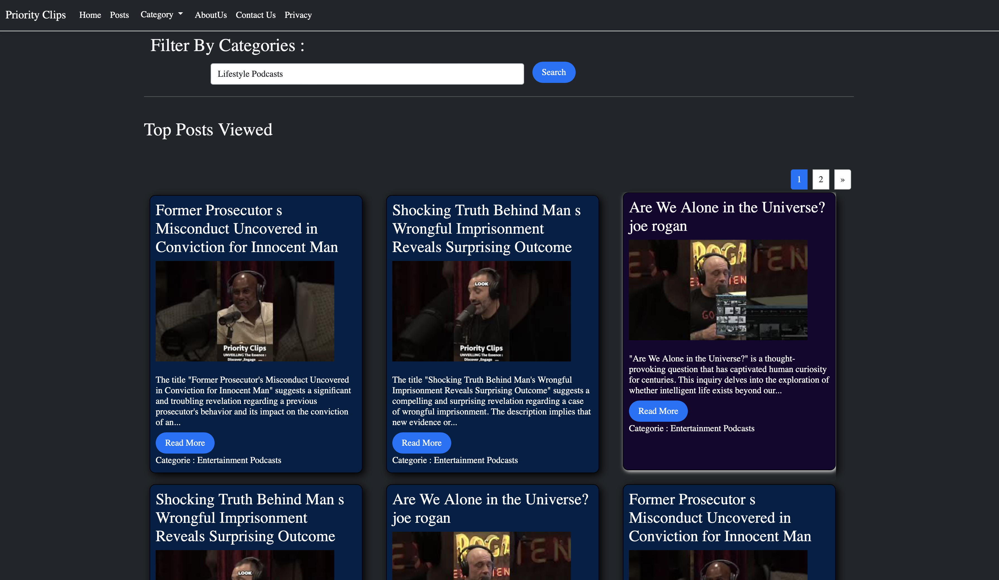
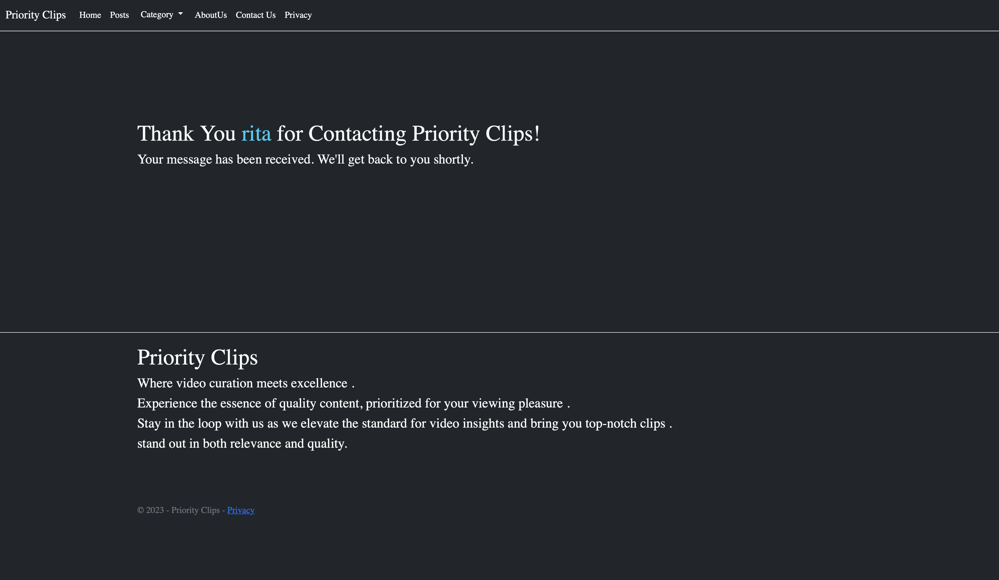

1 =>  Configure the Database Connection String
Update the connection string in the appsettings.json file to match your SQL Server instance:

"ConnectionStrings": {
  "StringChainCnx": "Server=tcp:{your server database},1433;Initial Catalog={your database};Persist Security Info=False;User ID={Your User Id };Password={your password};MultipleActiveResultSets=False;Encrypt=True;TrustServerCertificate=False;Connection Timeout=30;"
}

2 => new terminal > dotnet ef database update .

3 => dotnet build > dotnet run

screenshots : 

Admin views : 

Public  views : 

